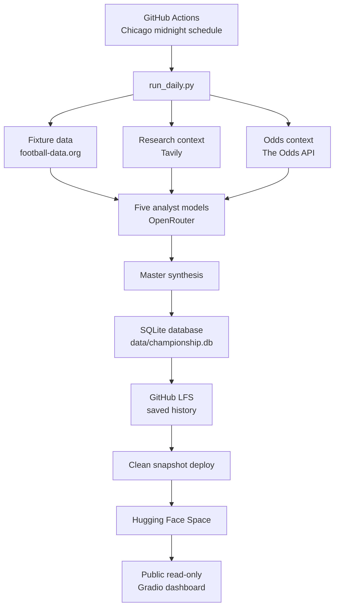

# AI World Cup Championship

**Live app:** [huggingface.co/spaces/xchen49/world-cup-ai-championship](https://huggingface.co/spaces/xchen49/world-cup-ai-championship)

[English](#english) | [中文](#中文)

> Disclaimer: This project is an AI model championship and research demo. It is not betting, gambling, investment, or financial advice. Model outputs can be wrong and must not be used as a basis for wagering.

## English

AI World Cup Championship turns each FIFA World Cup matchday into a public multi-model competition. Five AI analysts produce independent match previews, a master model synthesizes the final view, and a post-match judge scores the analysts after the result is known.

The public Gradio app is read-only by default: it loads saved analysis from the database instead of allowing visitors to trigger paid model/API calls.

## What It Does

- Pulls daily World Cup fixtures from football-data.org.
- Collects match context through Tavily: team news, injuries, form, tactics, venue, weather, and referees.
- Adds structured odds context from The Odds API when available.
- Runs five OpenRouter analyst models independently.
- Uses one master model to synthesize the final match preview.
- Stores every match, model output, final conclusion, review, and leaderboard in SQLite.
- Evaluates finished matches with a fixed 5-to-1 scoring system and updates the leaderboard.
- Deploys a public dashboard to Hugging Face Spaces.

## Architecture



## Data And Persistence

The app stores production output in `data/championship.db`. The database is tracked through Git LFS so GitHub Actions can read the latest saved state, update it, commit it back to GitHub, and sync a clean snapshot to Hugging Face Spaces.

The Hugging Face Space should show saved output through **Load saved**. Public visitors cannot run fresh analysis unless `ENABLE_GRADIO_RUN=true` is explicitly set.

## Local Setup

```powershell
python -m venv .venv
.venv\Scripts\Activate.ps1
pip install -r requirements.txt
```

Create a local `.env` file:

```env
OPENROUTER_API_KEY=your_openrouter_key
TAVILY_API_KEY=your_tavily_key
FOOTBALL_DATA_API_KEY=your_football_data_key
ODDS_API_KEY=your_the_odds_api_key

MATCH_TIMEZONE=America/Chicago
LOG_LEVEL=INFO
GRADIO_SHARE=false
ENABLE_GRADIO_RUN=true
```

Run one analysis locally:

```powershell
python run_daily.py --date 2026-06-23
python app.py
```

## Automation

The GitHub workflow can be run manually or on schedule. The schedule fires at UTC `05:05` and `06:05`; a midnight guard ensures only the invocation matching Chicago midnight actually performs analysis.

Required GitHub Actions secrets:

- `OPENROUTER_API_KEY`
- `TAVILY_API_KEY`
- `FOOTBALL_DATA_API_KEY`
- `ODDS_API_KEY`
- `HF_TOKEN`

For the first manual run, provide a date such as `2026-06-23` so the workflow runs immediately instead of waiting for the midnight guard.

## 中文

AI World Cup Championship 是一个世界杯 AI 模型锦标赛展示项目。每天系统会读取世界杯赛程，让五个 AI 分析员分别给出赛前观点，再由一个 master model 做最终综合。比赛结束后，系统会根据真实常规时间赛果给模型打分，并更新排行榜。

公开页面地址：**[huggingface.co/spaces/xchen49/world-cup-ai-championship](https://huggingface.co/spaces/xchen49/world-cup-ai-championship)**

重要免责声明：本项目只是 AI Championship 模型比赛展示与娱乐研究，不构成博彩、投注、投资或财务建议。模型输出可能出错，赔率和赛况会变化，请勿将本页面内容作为下注依据。

## 中文功能简介

- 自动读取每日世界杯赛程。
- 收集团队新闻、伤停、近期状态、战术、场地、天气、裁判等信息。
- 在可用时加入结构化赔率信息作为模型分析参考。
- 五个模型独立分析同一场比赛。
- master model 汇总最终观点。
- 用 SQLite 保存比赛、模型输出、最终结论、赛后复盘和排行榜。
- 赛后根据常规时间结果给模型评分。
- 通过 Hugging Face Spaces 提供公开 Gradio dashboard。

## 公开页面如何使用

公开 Gradio 页面默认是只读展示：

- 选择日期。
- 点击 **Load saved**。
- 在 Match 下拉菜单里选择比赛。

公开页面默认不会显示 **Run / refresh analysis**，避免任何访客触发付费 API 或模型调用。如果你在本地私用需要手动运行分析，可以设置 `ENABLE_GRADIO_RUN=true`。

## 运维说明

生产数据库是 `data/championship.db`，通过 Git LFS 保存。GitHub Actions 每次运行时会读取现有数据库，更新当天结果，再提交回 GitHub，并同步到 Hugging Face Space。

如果手动运行 workflow 且希望马上执行，请填写日期，例如 `2026-06-23`。如果不填日期，workflow 会使用芝加哥时间当天日期，但只有在芝加哥午夜 guard 通过时才会真正运行。
